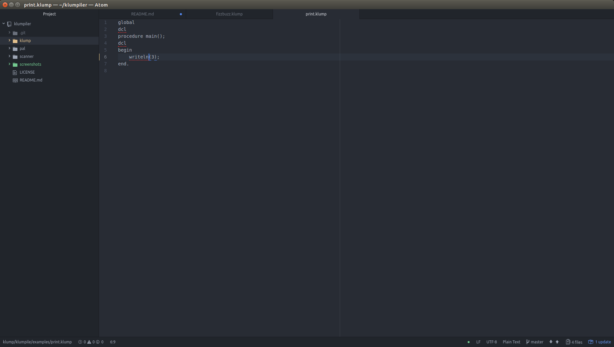
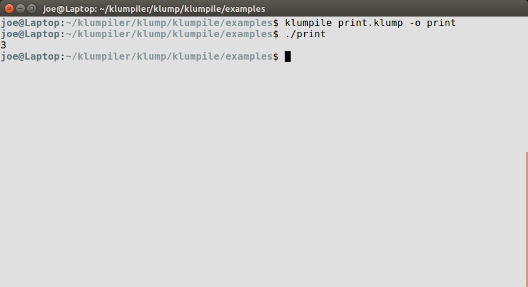
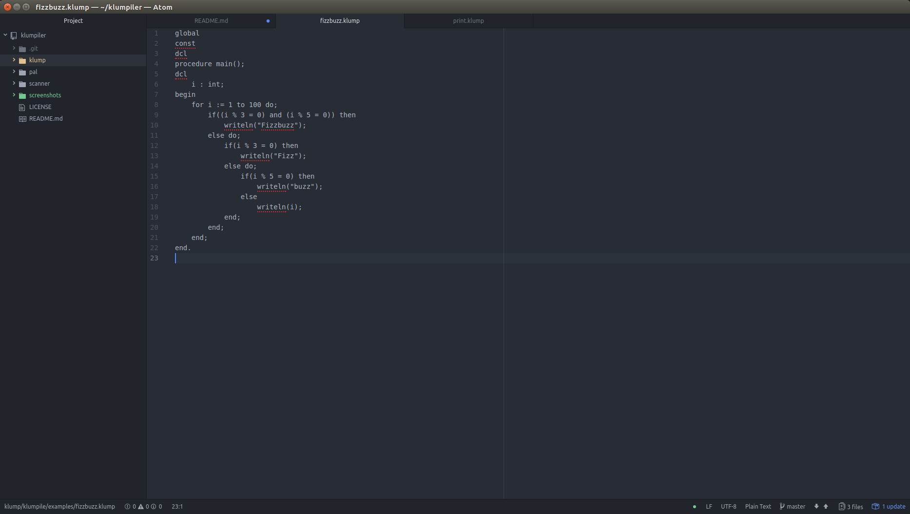
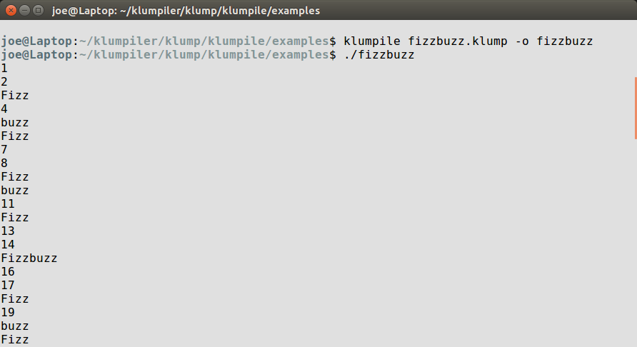
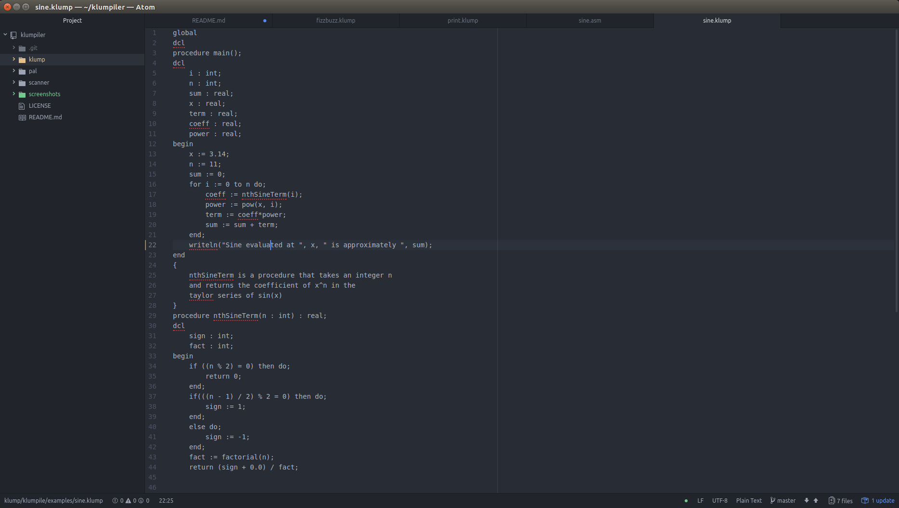
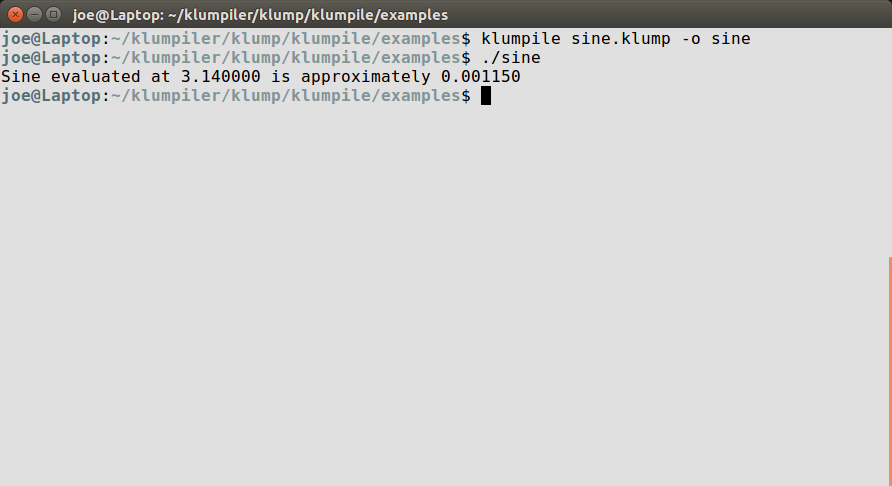
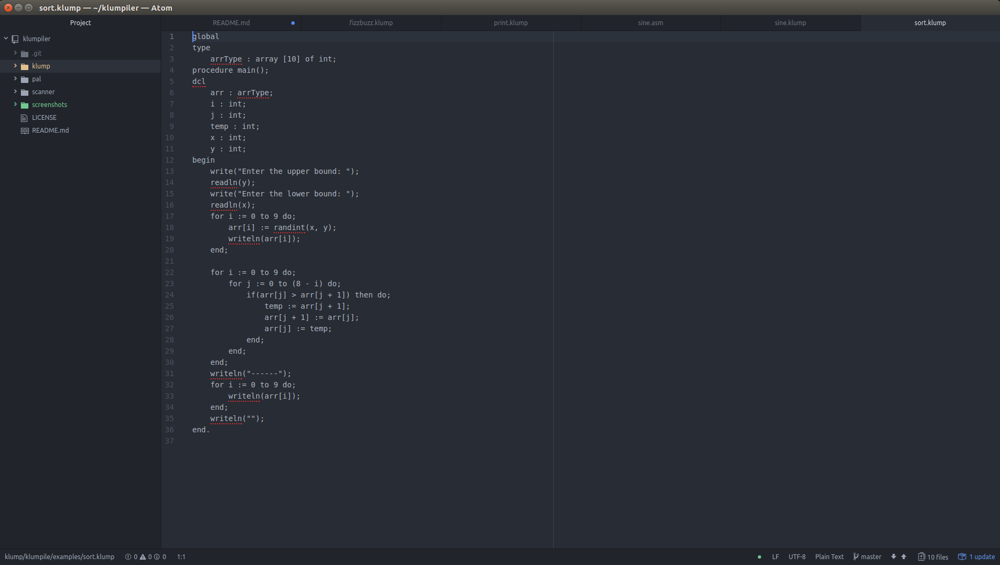
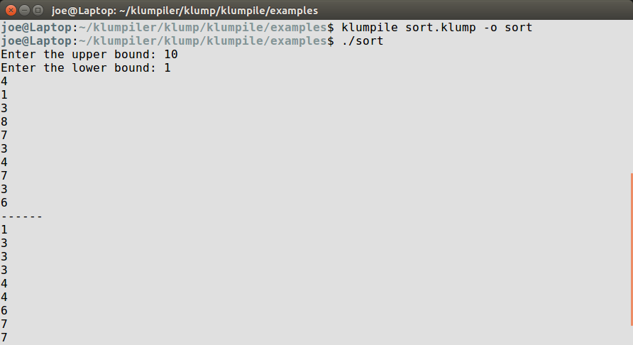

# Klumpiler

Klumpiler is a project to create a compiler for the Klump programming language. Sample klump files can be found throughout the repository, indicated by **.klump** extensions.

To compile a new version of klumpiler, navigate to the klumpile directory

`cd klump/klumpile/`

And compile using g++

`g++ klumpile.cpp -o klumpile`

The previous command will create an executable named klumpile in the current directory. From there, you can add it to your system path as appropriate for your operating system. On Ubuntu this can be done by running `cp klumpile ~/bin/`. If `~/bin/` does not exist, create it first with `mkdir ~/bin/`.

To compile a *.klump* file using this compiler use the command `klumpile <klump program> [-o output executable] [-s output assembly]`. This requires nasm and gcc to be preinstalled.

By default, it will create an executable named `a.out` in your current directory. The -o flag changes the name of this executable. If the -s flag is used, it will also keep the assembly output in the desired file name.

As an example `klumpile test.klump -o test -s output.asm` will compile the program located in `test.klump`. The generated assembly will be in `output.asm` and the executable will be named `test`.

To manually assemble and link a generated assembly file, use the following commands

`nasm -felf32 <assembly file> -o <object file name>`

`gcc -m32 <object file name> -o <executable name>`

---
# Examples

Code for these examples is located in `/klump/klumpile/examples/`. It also contains the generated assembly code for each program.

## print.klump

This code was created to show a simple klump program. It prints the number three. It utilizes write statements.

### Code:

### Output:

## fizzbuzz.klump

This code was created to solve the classical "fizzbuzz" problem. For numbers divisible by 3, it prints "Fizz." For numbers divisible by 5, it prints "Buzz." For numbers divisible by both, it prints "Fizzbuzz." Otherwise, it prints the number. This program utilizes the compiler's implementation of local variables, for loops, arithmetic, if statements, else statements, and write statements.

### Code:

### Output:

## sine.klump

This code was created to calculate the sine of a value. It tests local variables, integer and floating point arithmetic, recursion, functions, for loops, write statements, constants, if statements, and else statements.

### Code:

### Output:

## sort.klump

This code was created to randomly generate and sort an array. It tests local variables, comparisons, booleans, if statements, else statements, arrays, random numbers, write statements, and read statements.

### Code:

### Output:

